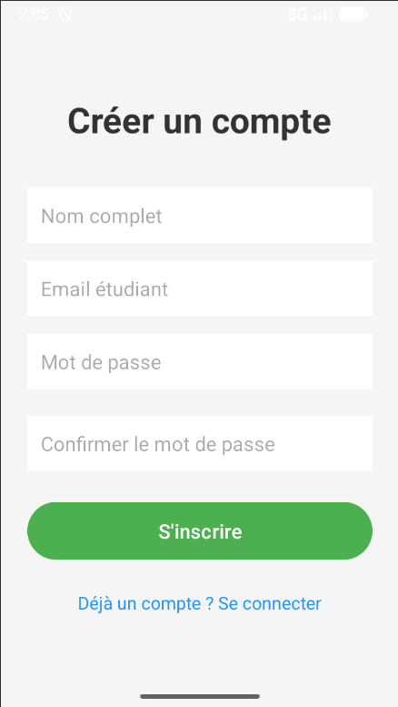
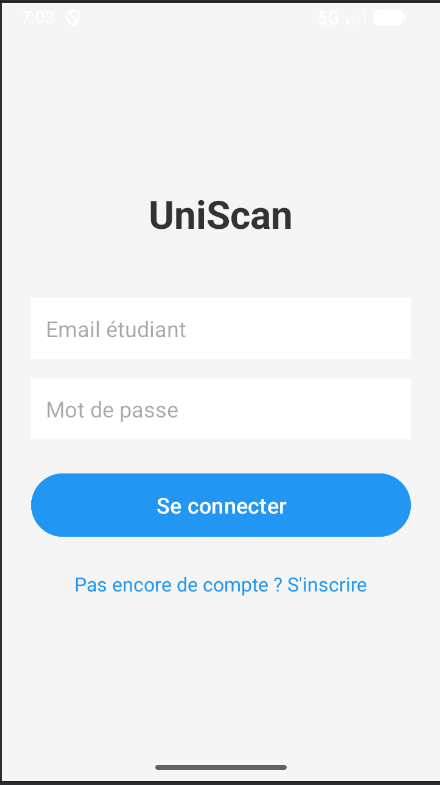
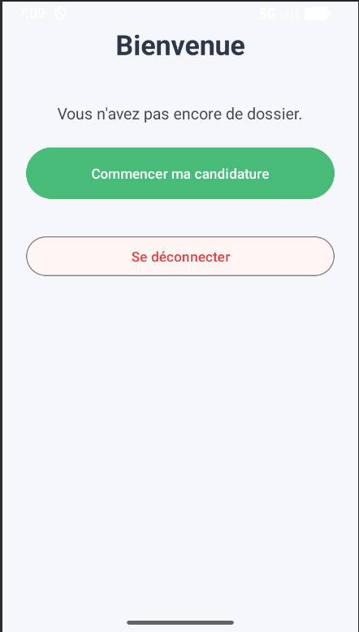
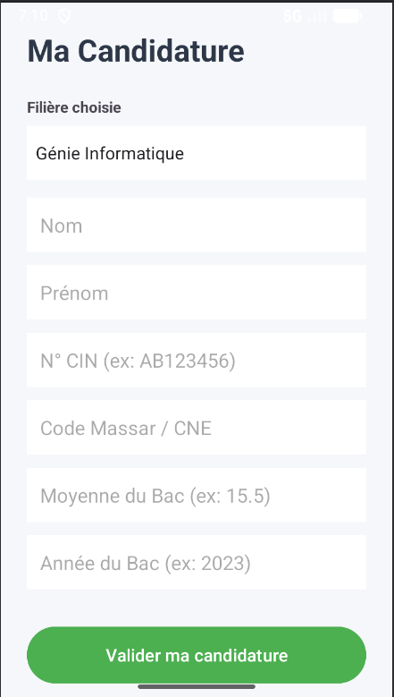
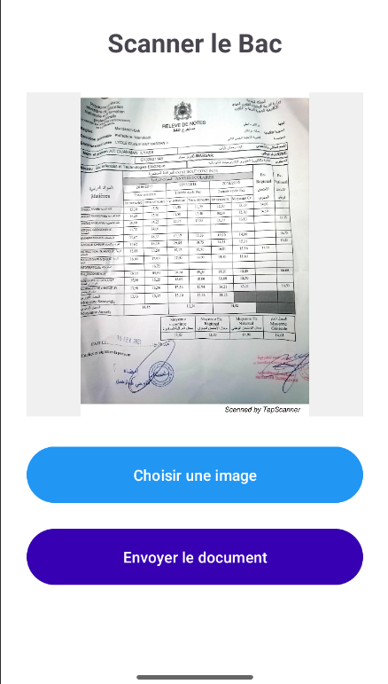
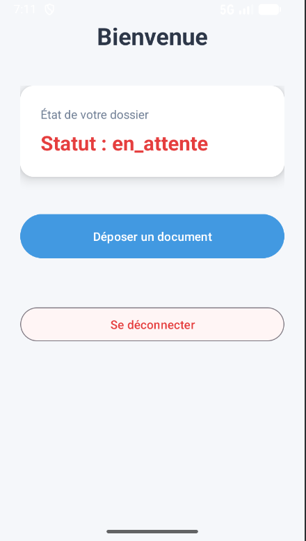
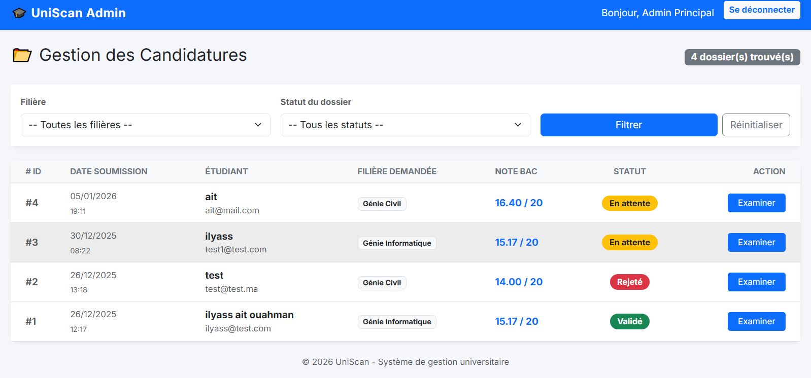
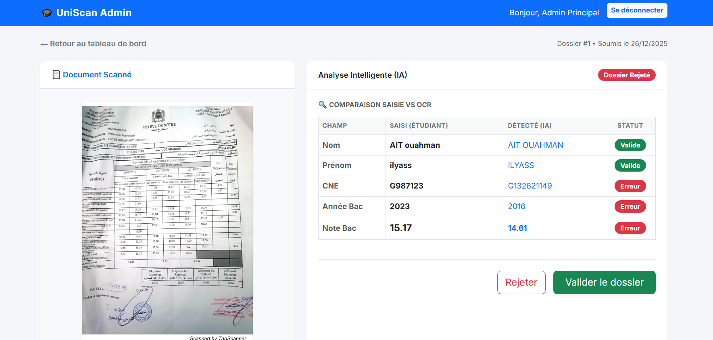
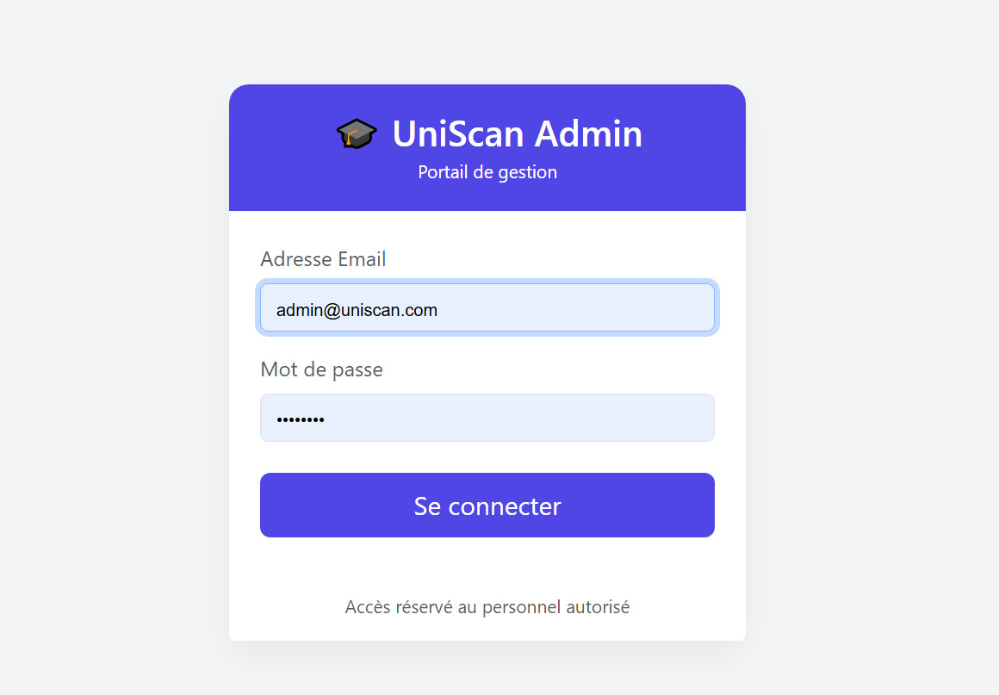

# 🎓 UniScan - Smart Student Registration & OCR


**UniScan** est une solution complète (Mobile + Backend) qui digitalise l'inscription universitaire. L'application permet aux étudiants de soumettre leur dossier et utilise l'**Intelligence Artificielle** pour vérifier automatiquement la cohérence des données saisies (Nom, Notes, CNE) en scannant leurs documents officiels.

---
## 📸 Aperçu du Projet

### 📱 Application Étudiant (Mobile)
L'étudiant crée un compte, remplit ses informations, scanne ses justificatifs (Bac, CIN) et suit l'état de sa demande en temps réel.

| Inscription & Login | Tableau de bord | Formulaire Candidature |
|:---:|:---:|:---:|
|   |  |  |

| Scan Intelligent (OCR) | Suivi du Statut |
|:---:|:---:|
|  |  |

---

### 🖥️ Portail Administrateur (Web)

L'administration dispose d'un outil puissant pour filtrer les candidatures et valider les dossiers grâce à l'IA qui détecte les fraudes ou erreurs de saisie.

**1. Tableau de bord de gestion**

Vue globale avec filtrage par filière et statut des dossiers.


**2. Comparaison IA & Validation**

L'IA compare les données saisies par l'étudiant avec celles extraites du document (OCR) et signale les incohérences (ex: Note du Bac falsifiée).


**(Interface de connexion administrateur)**


---

## 🚀 Fonctionnalités Principales

### 📱 Application Mobile (Android)
- **Authentification Sécurisée :** Connexion et Inscription via API (JWT Token).
- **Dashboard Dynamique :** Affichage intelligent (Formulaire d'inscription ou Suivi de statut).
- **Scanner de Documents :** Prise de photo ou import depuis la galerie (CIN, Bac).
- **Gestion des États :** En attente, Validé, Rejeté.

### ☁️ Backend (Laravel)
- **API RESTful :** Gestion des utilisateurs, candidatures et fichiers.
- **OCR Intelligent :** Intégration de **Google Cloud Vision** pour extraire le texte des images.
- **Vérification Automatique :** Algorithme comparant les données saisies vs les données extraites (Regex + Levenshtein).
- **Traitement Asynchrone :** Utilisation de `Queue/Jobs` pour un traitement OCR en arrière-plan sans bloquer l'utilisateur.

### 🖥️ Dashboard Admin (Web)
- **Vue d'ensemble :** Tableau de bord avec filtrage par **Filière** et par **Statut**.
- **Comparaison Visuelle :** Affichage côte à côte du document scanné et des données extraites.
- **Audit IA :** Badges automatiques ( Valide /  Erreur) basés sur la cohérence des données (ex: Note saisie vs Note détectée).
- **Prise de décision :** Validation ou Rejet avec motif (envoyé à l'étudiant).

---

## 🛠️ Stack Technique

| Composant | Technologie | Détails |
|-----------|-------------|---------|
| **Backend** | Laravel 10 | API, Sanctum, Eloquent |
| **Mobile** | Android (Java) | Retrofit 2, Gson, XML Layouts |
| **Database** | MySQL | Relations Users/Applications/Documents |
| **AI / OCR** | Google Vision API | Extraction de texte |
| **DevOps** | Git & Composer | Versioning et dépendances |

---

## ⚙️ Installation et Configuration

### 1️⃣ Backend (Laravel)

```bash
# 1. Cloner le projet
git clone [https://github.com/votre-pseudo/uniscan-backend.git](https://github.com/votre-pseudo/uniscan-backend.git)
cd uniscan-backend

# 2. Installer les dépendances
composer install

# 3. Configurer l'environnement
cp .env.example .env
php artisan key:generate

# 4. Base de données
# Créez une BDD "uniscan" et configurez le .env
php artisan migrate

# 5. Configuration Google Vision
# Placez votre fichier "google-credentials.json" dans storage/app/
# Ajoutez dans .env : GOOGLE_APPLICATION_CREDENTIALS=storage/app/google-credentials.json

# 6. Créer le lien symbolique pour les images (Important !)
php artisan storage:link

⚠️ Important - Pour que l'OCR fonctionne : Vous devez lancer ces deux commandes dans deux terminaux séparés :

# Terminal 1 : Lance le serveur API
php artisan serve

# Terminal 2 : Traite les images en arrière-plan (Queue Worker)
php artisan queue:work

```
### 2️⃣ Mobile (Android)

1. Ouvrir le dossier `android/` dans **Android Studio**.
2. Laisser **Gradle** télécharger les dépendances et synchroniser le projet.
3. Configurer l'adresse IP du serveur dans le fichier `ApiClient.java` (`app/java/com.example.uniscan/api/ApiClient.java`) :


```java
// - Option A : Vous utilisez l'Émulateur Android
// L'adresse 10.0.2.2 est une adresse spéciale qui redirige vers le localhost de votre PC.
private static final String BASE_URL = "[http://10.0.2.2:8000/api/](http://10.0.2.2:8000/api/)";

// - Option B : Vous utilisez un vrai téléphone (via Câble/Wi-Fi)
// Remplacez les XX par l'adresse IP locale de votre PC (ex: via ipconfig/ifconfig)
// private static final String BASE_URL = "[http://192.168.1.](http://192.168.1.)XX:8000/api/";
```

